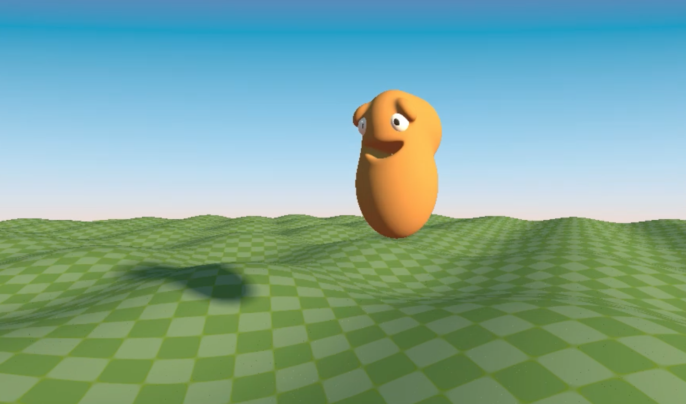
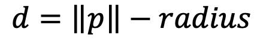
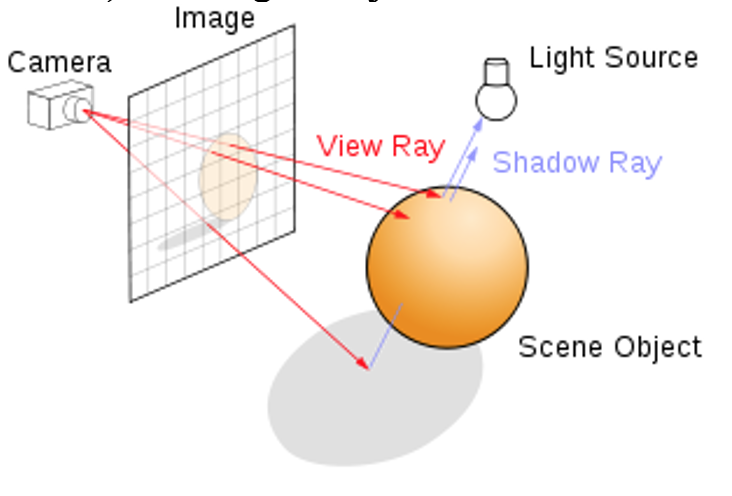
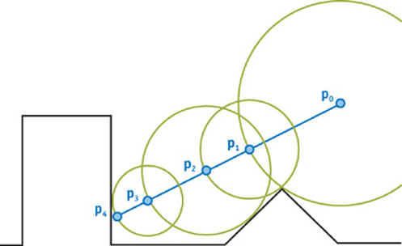
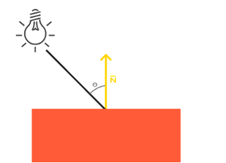
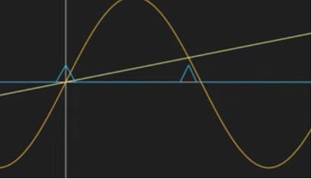
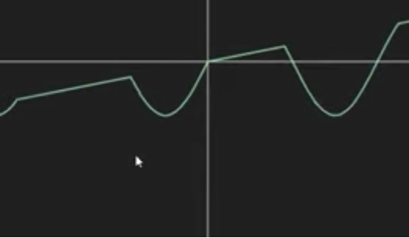
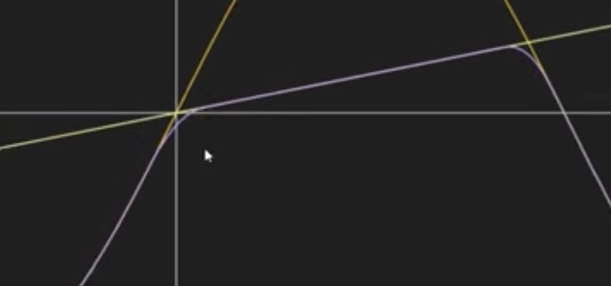

# Simulation using using Ray Marching
## Introduction
I created a figure jumping and advancing on a slightly curved surface.
Most of the code is glsl written in the fragment shader.
the framework is OpenGL, but there are only four vertices to create a rectangle in which the scene is rendered.



## Signed Function
The basic idea is to use signed distance functions for simple shapes.
The function returns the distance from a point p to the surface of the object.
	If the point is outside the objects the distance is positive
	If the point is inside the object the distance negative.
	If the point is on the surface the distance is zero.
So for example the signed distance function of a sphere is for a point p:



In glsl:

```python
float sdSphere(in vec3 pos,in float rad)
{
    float d = length(pos) - rad;
    return d;
}
```
## Ray Marching
We use ray marching to detect if a ray(from the camera towards the pixel on the screen) is hitting an object and what is the distance to that objects.


the vector p is incremented in a loop until it hits an object surface according  to *signed function* returned value.
The value of the incrementation in the loop is determined by the distance returned from the min(*signed function*_1,… *signed function*_n
Which is the  map  function in the example:

```python
vec3 pos = ro + t*rd;
vec2 h = map(pos);
```



If after a reasonable amount of iterations(MAX_MARCHING_STEPS) the ray didn’t hit an object , the loop breaks. For example:

```python
float shortestDistanceToSurface(vec3 eye, vec3 marchingDirection,
 float start, float end) {
    float depth = start;
    for (int i = 0; i < MAX_MARCHING_STEPS; i++) {
        float dist = sceneSDF(eye + depth * marchingDirection);
        if (dist < EPSILON) {
            return depth;
        }
        depth += dist;
        if (depth >= end) {
            return end;
        }
    }
    return end;
}
```

In order the distinguish between objects and their colors(material)
Each signed function can return not just the distance but also its “id”.
And according to that id we can determined the pixel color we want to assign to that object.
For example:

```python
float d_eyes = sdSphere(sh - vec3(0.08,0.28,0.16),0.05);
    if(d_eyes<d)
    {
        res = vec2(d_eyes,3.0);
    }
```

D is a former distance which was calculated from other signed functions.
I want to give the eyes a different color.
So I assigned to res not just the distance to the eyes(d_eyes) but also 
an “id” =3.0.

and now in the calling function I can do the following:
…t_obj = res

```python
else if(t_obj.y<3.5)
        {
            mate = vec3(0.4,0.4,0.4);
        }

```

## Light
To calculate light we need the normal to each point on the surface.
The gradient is the optimal slope for the fastest change in the functions.
Lets take for instance the sphere signed function. The direction which makes the most change is from the center of the sphere to its surface which is actually the normal. 
So we can use the gradient of the signed function to calculate the normal.
We take a tiny step in each component(x,y,z)

```python
vec3 calcNormal(in vec3 pos)
{
    vec2 e = vec2(0.00001,0.0);
    return normalize(vec3(
                    map(pos+e.xyy)-map(pos-e.xyy),
                    map(pos+e.yxy)-map(pos-e.yxy),
                    map(pos+e.yyx)-map(pos-e.yyx)) );
        
}
```

And now we can calculate the light:
Diffuse


```python
vec3 sun_dir = normalize(vec3(0.8,0.3,0.2));
float sun_dif = clamp(dot(sun_dir,nor),0.0,1.0);
```

the clamp is used because we don’t want to have negative values from the dot product which occur when the light hits the surface on the back side.

We can use some blue color flavour from the “sky” which is at (0.0,1.0,0.0)

```python
float sky_dif = clamp(0.5+0.5*dot(nor,vec3(0.0,1.0,0.0)),0.0,1.0);
```

and then add the colors

```python
col = mate*vec3(7.0,5.0,3.0)*sun_dif*sun_sha;
col += mate*vec3(0.5,0.8,0.9)*sky_dif;
```

and a “bounce” light from the ground. Otherwise the side opposite to the light would be totally black(0.0,0.0,0.0). and we don’t want that.
Hence:

```python
float bou_dif = clamp(0.5+0.5*dot(nor,vec3(0.0,-1.0,0.0)),0.0,1.0);
col += mate*vec3(0.7,0.3,0.2)*bou_dif;
```

## Smoothening intersections between objects
When 2 object intersects they intersection plain is very sharp for example the head (a sphere) and the body(an elipsoide).
For the smoothening  fmin function was used.
Let f(x),g(x) be functions. 
Suppose they intersect at point x=t.
We would like  to smooth at: [t-ϵ,t+ϵ]. In the code the ϵ=k
Lets take a look at an concrete example:
f(x) = sin(x)
g(x) = linear function of x
e want to smooth the area where the blue spikes are.


Which are : h=max⁡(k-(abs(f(x)-g(x)),0.0)  - the 1st line in the code.

```python
float smin(in float a,in float b,in float k)
{
    float h = max(k-abs(a-b),0.0);
    return min(a,b) - h*h/(k*4.0);

}
```

The 2nd line smooths it, by taking h^2   giving  it more a more curvy look. Without smothing it would look like that:
<p>


With smoothing(the purple curve):




## The Figure
the figure is made of spheres and ellipticals, using the fmin function mentioned above.

## Movement
**Y direction:**
When the figure is going downwards the body which is elliptic changes to reflect the “squeeze” effect: the radius in the y axis of the elliptic decreases and radius in the x and z axis increase.

**Z direction:**
The figure is moving towards the negative z axis and camera is following that direction.
with the Mouse one can change the view angle.


## Animation
Basically the animation is a movement in the y axis direction.
I get from the OpenGL program the time as a uniform parameter.
and use the fract  function to get just the fraction part of the time.

```python
float t = fract(iTime);
```
So t gets the following values:
t=0.0,0.1,…,0.9,0.0,0.1,…
Then I calculate the y position which is parabolic in t.
```python
float y = 4.0*t*(1.0-t);
vec3 cen = vec3(0.0,y,0.0);
```
cen is the center of the figure.
the parabola roots are f(0)=f(1)=0 (according to our domain) and the maxima is at f(-0.5)=1. Meaning: 0≤y≤1
Now I calculate the radius of the body(lower altitude -> squeezed body)

```python
float sy = 0.5+0.5*y;
float sz = 1.0/sy;
vec3 rad = vec3(0.25,0.25*sy,0.25*sz);
```
lastly i’m calling the signed functions with the new position and new radius.
```python
vec3 pos_body = pos-cen;    
    float d_body = sdElipsoid(pos_body,rad);
```

Refereces:

http://jamie-wong.com/2016/07/15/ray-marching-signed-distance-functions/
https://michaelwalczyk.com/blog-ray-marching.html
https://www.youtube.com/channel/UCdmAhiG8HQDlz8uyekw4ENw

